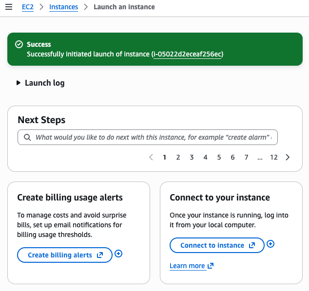
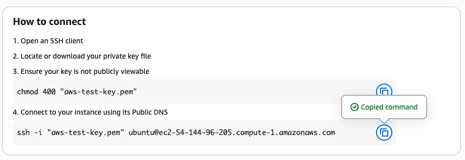

# AWS ec2 intanstance
This is a project from roadmaps for setting up an AWS ec2 instance and can be found here:

https://roadmap.sh/projects/ec2-instance

## Requirements
Goal is to create an AWS account, setup a Linux server on AWS EC2 and deploy a simple website.
- create an AWS account or use an existing account
- familiarize yourself with AWS Management Console
- launch an EC2 instance
  - use Ubuntu Server AMI
  - instance type: `t2.micro`
  - use default VPC and subnet for your region
  - config security group to allow inbound traffic on
    - port 22 for SSH
    - port 80 for HTTP
  - create a new key pair or use existing one for SSH access
  - assign a public IP address to the EC2 instance
- connect to the EC2 instance using SSH and private key
- update system packages
- install a web server like Nginx
- create simple HTML file for the static website
- deploy static website to the EC2 instance
- access website using the public IP of the EC2 instance

### Stretch goal
- setup up a custom domain name for the website
  - use Amazon Route 53
- implement HTTPS
  - use free SSL/TLS certificat from Let's Encrypt
- create a CI/CD pipeline using AWS CodePipeline
  - use to deploy changes to your website

## Create AWS account or login
Use this page to create or login to an account:
`https://aws.amazon.com/`

Once an account is setup login to the AWS management console to setup an EC2 instance

## Create an Ec2 instanace
Use the console to select the requirements for the instance.

## Connect to the Ec2 instance
After creating the SSH key pair, move the pem file from you Downloaded area to your ssh location.
```bash
mv ~/Downloads/aws-test-key.pem ~/.ssh/.
```

Change the permissions to read only by you
```bash
cd ~/.ssh
chmod 400 aws-test-key.pem
```

Use ssh to connect to the new instance. The instance name will change and can be accessed from the EC2 instance page by selecting "Connect to your instance" button.



The Instance page will have the commands you need to connect to your instance.



When the ssh command connects you will be the ubuntu user and have a minimal set of account files (dot files) in the ubuntu user home directory

### Terminate the instance
Terminate the instance when you are done using the instance to save on charges

Navigate to the instance status page and select terminate from the 'instance state' drop down menu.


