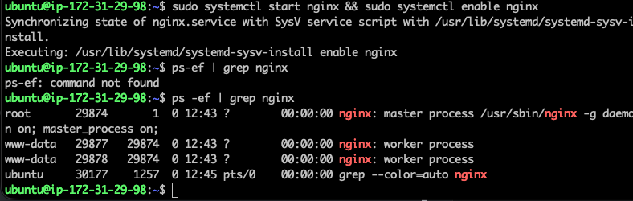
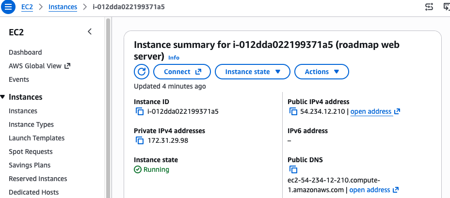

# AWS ec2 intanstance
This is a project from roadmaps for setting up an AWS ec2 instance and can be found here:

https://roadmap.sh/projects/ec2-instance

## Requirements
Goal is to create an AWS account, setup a Linux server on AWS EC2 and deploy a simple website.
- create an AWS account or use an existing account
- familiarize yourself with AWS Management Console
- launch an EC2 instance
  - use Ubuntu Server AMI
  - instance type: `t2.micro`
  - use default VPC and subnet for your region
  - config security group to allow inbound traffic on
    - port 22 for SSH
    - port 80 for HTTP
  - create a new key pair or use existing one for SSH access
  - assign a public IP address to the EC2 instance
- connect to the EC2 instance using SSH and private key
- update system packages
- install a web server like Nginx
- create simple HTML file for the static website
- deploy static website to the EC2 instance
- access website using the public IP of the EC2 instance

### Stretch goal
- setup up a custom domain name for the website
  - use Amazon Route 53
- implement HTTPS
  - use free SSL/TLS certificate from Let's Encrypt
- create a CI/CD pipeline using AWS CodePipeline
  - use to deploy changes to your website

## Create AWS account or login
Use this page to create or login to an account:
`https://aws.amazon.com/`

Once an account is setup login to the AWS management console to setup an EC2 instance

## Create an EC2 instanace
Use the console to select the requirements for the instance.
1. Launch an Instance
2. Name and tag: roadmap-test
3. Application and OS Images: Ubuntu
4. Instance Type: t3.micro
5. Key Pair: aws-test-key
  - If need new key pair, select Create new key pair
    - name: aws-test-key
    - should download the pem file to Projects
6. Leave defaults for rest of form
7. Select Launch Instance
  - bottom right corner
8. Once complete, should see a green Success banner
9. Select View all instances button
  - bottom right corner

## Connect to the EC2 instance using SSH
After creating the SSH key pair, move the pem file from you Download directory to your private ssh location.
```bash
mv ~/Downloads/aws-test-key.pem ~/.ssh/.
```

Change the permissions to read only by you
```bash
cd ~/.ssh
chmod 400 aws-test-key.pem
```

Use ssh to connect to the new instance. The instance name will change and can be accessed from the EC2 instance page by selecting "Connect to your instance" button.


The Instance page will have the commands you need to connect to your instance.


When the ssh command connects you will be the ubuntu user and have a minimal set of account files (dot files) in the ubuntu user home directory

### Terminate the instance
Terminate the instance when you are done using the instance to save on charges.

Navigate to the instance status page and select terminate from the 'instance state' drop down menu.


## Update System packages
With you EC2 instance running, update the system packages for your ubuntu or debain instance. Run the following command via your ssh session. 
- You should see lots of packages being installed and unpacked along with a progress bar.
- This will take several minutes to complete

```bash
sudo apt update && sudo apt upgrade -y
```

## Install the web server
We will use nginx to be our web server. For ubuntu or debain via your ssh session to your EC2 instance run the following command.

```bash
sudo apt install nginx -y
```

## Start the web service
To start the nginx web service, use systemctl to start and enable the service

```bash
sudo systemctl start nginx && sudo systemctl enable nginx

# verify nginx is runing
ps -ef | grep nginx
```



Now to see your new web server in a browser, setup in your EC2 instance port 80 by using a security group. 
- Navigate to the EC2 instance via the Instance Console
  - select the security group to launch the security wizard
- From the Secuity Group wizard, edit the inbound rules
  - add a new rule
    - Type: HTTP
    - Port: 80
    - Source: Anywhere-IPv4(0.0.0.0/0)

To obtain the given IP address use the EC2 console and select the Public IPv4 address to copy and paste the address. You will need to change the address to use http instead of https. You should now see the "welcome to nginx!" default page.




## Create the Static Website
Use a simple HTML index file for the new nginx web service to serve.
- use the simple static site project as this has a static web site and deployment scripts
- use git clone to pull in the project

### Clone your static site github project
```bash
# setup your instance of git
sudo apt update && sudo apt install git -y

# naviagate to nginx public web directory
cd /var/www/html

# set permissions
sudo chown -R ubuntu:ubuntu .

# clone your static site server repository
git clone https://github.com/jjk66/static-site-server.git
```

### Configure Instance to run website
Some adjustments are needed to allow the website to run on your instance
```bash
# move content from sub folder to current location
mv static-site-server/simple-static-site/* .

# remove your cloned directory
rm -rf static-site-server

# Adjust permissions so nginx can read them
sudo chown -R www-data:www-data /var/www/html/

# Clear out nginx default landing page
rm index.nginx-debian.html
```

### Restart nginx
After the configurations are complete, restart nginx service to host your static server site
```bash
# restart nginx
sudo systemctl restart nginx
```

## Stretch Goal - Use a custom domain name
You will need to associate a public IP address to your running (or stopped) EC2 instance. AWS calls this an Elastic IP.
1. Allocate the IP address
  - From the AWS EC2 Console, select Network & Security -> Elastic IPs
  - Click Associate Elastic IP address
  - use all defaults, select Allocate
2. Associate the Elastic IP address
  - Select the associated IP address
  - Select Actions, choose Associate Elastic IP address
  - Select your EC2 instance, choose the corresponding IP address
  - Click Associate
3. Add HTTP and HTTP inbound rules
  - From EC2 instance, select Security tab at bottom
  - Click Security Group
  - Click Edit inbound rules
  - add the following:
    - HTTP: Port 80, source 0.0.0./0 (Anywhere)
    - HTTPS: Port 443, source 0.0.0/0 (Anywhere)
  - Click Save rules
4. Point your custom domain to the Elasitc IP address
  - For a 3rd party registar, use the DNS Management page to add the associated and allocated Elastic IP address
    - remove any existing A or C records
    - add an A record 
      - Type: A
      - Name/Host: @
      - Value/Points To: associated Elastic IP address
      - TTL: leave as default
5. Configure Nginx to use your domain name
DNS will now be routing your domain name traffic to your EC2 instance but Nginx needs to know about it. You need to edit the nginx configuration file and reload it.
```bash
sudo nano /etc/nginx/sites-available/default
# Edit server_name entry to use your domain name
# example: server_name jjklug.site
# save the file
# Test the syntax
sudo nginx -t

# Apply the changes via reload
sudo systemctl reload nginx
```

### Stretch Goal - Implement HTTPS
To implement https we will use opensource project Let's Encrypt which is free to use. It uses Certbot to issue a certificate.

#### Install Certbot on your instance
Certbot is used to obtain and renew Let's Encrypt certificates.
```bash
sudo apt update
sudo apt install certbot python3-certbot-nginx -y
```

#### Obtain and install SSL certificate
The Certbot tool will modify the Nginx configuration to support HTTPS and handles the verification process. This is implemented via an Nginx plugin.
```bash
# Command to have certbot automatically handle the security handshake and configure Nginx to redirect all HTTP traffic to HTTPS
# Example
# sudo certbot --nginx -d yourdomain.com -d ://yourdomain.com
sudo certbot --nginx -d jjklug.site

#- Follow the interactive prompts
#  - enter email address for renewal notifications
#  - agree to terms of service
#  - choose to share or not with EFF

# Verify renewal service is working properly
sudo certbot renew --dry-run
```

### Verify Site is using custom domain name
From your SSH session, perform an nslookup on your domain name
```bash
# Verify your EC2 Instance Elastic IP address for your domain name
nslookup jjklug.site
```

If all is good, you should be able to access your web site via your domain name in your browser.

My example using my domain name: 'https://jjklug.site'